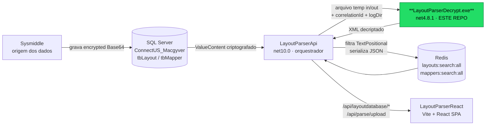

# LayoutParserDecrypt

> Utilitário de linha de comando (**.NET Framework 4.8.1**) que **descriptografa** os *mappers* e *layouts* da **Sysmiddle** para que a API os publique no **Redis**.

`LayoutParserDecrypt` é a peça de **fronteira criptográfica** do ecossistema LayoutParser. Ele existe por um motivo concreto e não óbvio: a API (`LayoutParserApi`, **net10.0**) **não consegue executar o algoritmo legado `RijndaelManaged` em processo** de forma compatível, então a descriptografia é forçada **para fora do processo**, através deste executável **net4.8.1** invocado via `Process.Start`.

---

## Índice

- [Onde este projeto se encaixa](#onde-este-projeto-se-encaixa)
- [Contrato de linha de comando](#contrato-de-linha-de-comando)
- [Como funciona internamente](#como-funciona-internamente)
- [Criptografia](#criptografia)
- [Logs](#logs)
- [Build](#build)
- [Execução (exemplos)](#execução-exemplos)
- [Implantação (deploy)](#implantação-deploy)
- [Estrutura do projeto](#estrutura-do-projeto)
- [Pontos de atenção (footguns)](#pontos-de-atenção-footguns)
- [Repositórios relacionados](#repositórios-relacionados)
- [Roadmap / melhorias sugeridas](#roadmap--melhorias-sugeridas)
- [Uso de IA neste repositório](#uso-de-ia-neste-repositório)

---

## Onde este projeto se encaixa

O ecossistema LayoutParser é composto por **quatro repositórios** que formam um único pipeline. A fonte da verdade é um **SQL Server** (`ConnectUS_Macgyver`, tabelas `dbo.tbLayout` e `dbo.tbMapper`), cuja coluna `[ValueContent]` guarda os layouts/mappers da Sysmiddle como **Base64 criptografado** (prefixo de 3 caracteres + AES/Rijndael).



| Repositório | Stack | Papel no pipeline |
|---|---|---|
| **LayoutParserDecrypt** *(este)* | net4.8.1 · console exe | Fronteira de processo: recebe arquivo criptografado, devolve texto em claro. Permite que o net10.0 use a cripto legada. |
| `LayoutParserLib` | net4.8.1 · class library | Dono **canônico** do algoritmo (`CryptographySysMiddle.Decrypt`) + `RollingFileLogger`. |
| `LayoutParserApi` | net10.0 · ASP.NET Core | Orquestrador: consulta SQL, invoca este `.exe`, extrai XML, filtra e grava no Redis, expõe a API HTTP. |
| `LayoutParserReact` | Vite + React 18 + TS | SPA: consome **apenas** a API HTTP; lê layouts cujo `decryptedContent` veio do Redis. |

> **Rastreabilidade ponta a ponta:** o `X-Correlation-ID` nasce no navegador (React), é repassado pela API e injetado neste executável (via `correlationId`/`LAYOUTPARSER_CORRELATION_ID`), aparecendo nos logs de todos os processos.

---

## Contrato de linha de comando

```
LayoutParserDecrypt.exe <inputFile> <outputFile> [correlationId] [logDir]
```

| Posição | Argumento | Obrigatório | Padrão | Descrição |
|---|---|---|---|---|
| `args[0]` | `inputFile` | ✅ | — | Caminho do arquivo de entrada (UTF-8) com o conteúdo criptografado. |
| `args[1]` | `outputFile` | ✅ | — | Caminho onde o texto descriptografado é gravado (UTF-8). |
| `args[2]` | `correlationId` | ❌ | `Guid.NewGuid()` | Id de correlação para os logs. |
| `args[3]` | `logDir` | ❌ | `<baseDir>\logs` | Diretório onde os arquivos de log são escritos. |

**Códigos de saída (`ExitCode`):**

| Código | Significado |
|---|---|
| `0` | Sucesso — `outputFile` gravado. |
| `1` | Falha — argumentos insuficientes (`< 2`), `inputFile` inexistente, ou exceção fatal durante a descriptografia. |

**Variáveis de ambiente (fallback):** em caso de exceção, o `logDir` pode ser lido de `LAYOUTPARSER_LOG_DIR`. A API também propaga `LAYOUTPARSER_CORRELATION_ID` e `LAYOUTPARSER_LOG_DIR` no processo filho, mas o caminho normal usa os argumentos posicionais.

---

## Como funciona internamente

Fluxo do [`Program.cs`](Program.cs):

1. Valida que há ao menos 2 argumentos (senão, sai com código `1`).
2. Configura o logger embutido (`RollingFileLogger.Configure(logDir, correlationId)`).
3. Lê `inputFile` inteiro como **UTF-8**.
4. **Remove os 3 primeiros caracteres** do conteúdo (prefixo/marcador — `Substring(3)`), quando o conteúdo tem mais de 3 caracteres.
5. Chama [`CryptographySysMiddle.Decrypt`](LayoutParserLib/CryptographySysMiddle.cs): `Convert.FromBase64String` → `RijndaelManaged.CreateDecryptor` → `CryptoStream` → `Encoding.UTF8.GetString`.
6. Grava o resultado em `outputFile` (UTF-8) e sai com código `0`.

> ⚠️ O **strip dos 3 caracteres** acontece **aqui no `Program.cs`**, e **não** dentro de `CryptographySysMiddle.Decrypt`. Quem chamar a *lib* diretamente **não** terá esse comportamento. Veja [Pontos de atenção](#pontos-de-atenção-footguns).

---

## Criptografia

- **Algoritmo:** `System.Security.Cryptography.RijndaelManaged` (AES, modo padrão do `SymmetricAlgorithm`).
- **Entrada:** string **Base64** (após o strip de 3 caracteres).
- **Chave e IV:** estão **hardcoded** no código-fonte, em [`CryptographySysMiddle.cs`](LayoutParserLib/CryptographySysMiddle.cs).

> 🔐 **Nota de segurança:** a chave e o IV de descriptografia estão **embutidos no binário** (e no código-fonte versionado). Qualquer um com acesso ao `.exe` ou ao repositório consegue reproduzir a descriptografia. Para um contexto produtivo, isso deveria migrar para um *secret store* (variáveis de ambiente, Azure Key Vault, `user-secrets`, etc.). Para o uso atual (ferramenta interna de pipeline), está documentado aqui como limitação conhecida.

---

## Logs

São gravados **dois** arquivos de log rotativos no `logDir`, por dois loggers distintos (ambos com a mesma política de rotação):

| Arquivo | Logger | Origem |
|---|---|---|
| `layoutparserdecrypt.log` | `LayoutParserDecrypt.RollingFileLogger` | Mensagens do [`Program.cs`](Program.cs) (START / Decrypting / END / FATAL). |
| `layoutparserlib.log` | `LayoutParserLib.RollingFileLogger` | Mensagens do algoritmo de cripto. |

**Política de rotação** (ambos): arquivo rola ao atingir ~**2 MB** (`2049 * 1024` bytes), mantendo os **10** arquivos mais recentes. Cada linha segue o formato:

```
2026-06-22T12:34:56.7890123Z [INF] [Corr:<correlationId>] <mensagem>
```

Falhas de log **nunca** lançam exceção (são engolidas) — logging jamais derruba a descriptografia.

---

## Build

**Alvo:** `.NET Framework v4.8.1`, `AnyCPU`, `OutputType=Exe`.

### Local (Visual Studio)
Abra [`LayoutParserDecrypt.sln`](LayoutParserDecrypt.sln) no Visual Studio 2022+ e compile em `Release`.

### Local (linha de comando)
```powershell
nuget restore .\LayoutParserDecrypt.sln
msbuild .\LayoutParserDecrypt.sln /m /p:Configuration=Release /p:Platform="Any CPU"
```
O binário sai em `bin\Release\LayoutParserDecrypt.exe`.

> 💡 **Sem Visual Studio / `msbuild` no PATH?** `dotnet build .\LayoutParserDecrypt.sln -c Release` também compila este projeto (validado). O `nuget restore` é dispensável: o projeto não tem pacotes NuGet.

### CI (GitHub Actions)
[`.github/workflows/build.yml`](.github/workflows/build.yml) compila em `windows-latest` (push em qualquer branch, PR, ou disparo manual) e publica como artefato:
- `bin\Release\LayoutParserDecrypt.exe`
- `bin\Release\LayoutParserDecrypt.exe.config`

> 💡 **Por que não há DLL separada:** o `.csproj` **inclui como fontes locais** os arquivos `LayoutParserLib\CryptographySysMiddle.cs` e `LayoutParserLib\RollingFileLogger.cs`. Isso torna o projeto **autocontido**, permitindo que o CI compile sem precisar do repositório `LayoutParserLib` ao lado. A cripto e o logger ficam **embutidos no próprio `.exe`**.

---

## Execução (exemplos)

```powershell
# Mínimo (input + output)
.\LayoutParserDecrypt.exe ".\entrada.b64" ".\saida.xml"

# Com correlationId e diretório de log explícitos
.\LayoutParserDecrypt.exe ".\entrada.b64" ".\saida.xml" "a1b2c3d4-0000" "C:\logs\layoutparser"

# Verificar o resultado da última execução
echo $LASTEXITCODE   # 0 = sucesso, 1 = falha
```

Em produção, **quem chama é a API**, não um humano: `DecryptionService.DecryptContent` (no `LayoutParserApi`) escreve o conteúdo criptografado em um arquivo temporário, invoca este `.exe` com timeout de 30s, lê o arquivo de saída e apaga ambos os temporários.

---

## Implantação (deploy)

A API localiza o executável pela chave de configuração `LayoutParserDecrypt:Path` (em `appsettings.json`), que aponta por padrão para:

```
C:\inetpub\wwwroot\layoutparser\api\LayoutParserDecrypt.exe
```

Ou seja, **o `.exe` deve ser publicado ao lado da API**. Caso a chave esteja vazia, a API tenta localizar o executável automaticamente, sondando, nesta ordem:

1. `<baseDir>\LayoutParserDecrypt.exe`
2. `<baseDir>\tools\LayoutParserDecrypt.exe`
3. `..\LayoutParserDecrypt\bin\Release\LayoutParserDecrypt.exe` (e `Debug`)

> ⚠️ Se o executável **não for encontrado**, a API registra um erro e **devolve o conteúdo ainda criptografado** (passthrough silencioso) em vez de lançar exceção. O parsing de XML subsequente falha item a item, sem erro explícito. Garanta que o deploy do `.exe` acompanhe sempre o deploy da API.

---

## Estrutura do projeto

```
LayoutParserDecrypt/
├── .github/workflows/build.yml      # CI: MSBuild Release em windows-latest
├── LayoutParserLib/                 # cópia VENDORIZADA do LayoutParserLib (p/ CI independente)
│   ├── CryptographySysMiddle.cs     #   algoritmo Rijndael/AES (canônico vive no repo LayoutParserLib)
│   └── RollingFileLogger.cs         #   logger do namespace LayoutParserLib
├── Properties/AssemblyInfo.cs
├── Program.cs                       # entrypoint: args → strip(3) → decrypt → grava saída
├── RollingFileLogger.cs             # logger do namespace LayoutParserDecrypt (usado pelo Program)
├── App.config                       # supportedRuntime v4.8.1
├── LayoutParserDecrypt.csproj
├── LayoutParserDecrypt.sln
└── LayoutParserLib.dll              # binário commitado (legado/vestigial)
```

---

## Pontos de atenção (footguns)

1. **Strip dos 3 caracteres mora só aqui.** `Program.cs` faz `Substring(3)`; `CryptographySysMiddle.Decrypt` **não**. Chamar a *lib* direto, sem remover o prefixo, produz resultado diferente (ou erro de Base64).
2. **Código duplicado / vendorizado.** `CryptographySysMiddle.cs` e `RollingFileLogger.cs` existem em **duas cópias**: a canônica no repo `LayoutParserLib` e a cópia local em `LayoutParserDecrypt\LayoutParserLib\`. **Elas podem divergir.** Ao alterar a cripto, sincronize as duas. A fonte da verdade é o repo `LayoutParserLib`.
3. **Segredos no código.** Chave/IV hardcoded (ver [Criptografia](#criptografia)).
4. **Passthrough silencioso na API.** `.exe` ausente ⇒ a API devolve conteúdo criptografado sem erro (ver [Deploy](#implantação-deploy)).
5. **Filtro `TextPositional`.** Do lado da API, **apenas** layouts com `LayoutType == TextPositional` chegam ao Redis; os demais são descartados silenciosamente. Bom saber ao depurar "layout sumiu do cache".
6. **Referência morta na API.** `LayoutParserApi.csproj` referencia `LayoutParserLib.dll`, mas **nenhum código da API usa** — a API só alcança a cripto pelo `.exe`. Candidata a remoção.

---

## Repositórios relacionados

| Repositório | Caminho local |
|---|---|
| `LayoutParserApi` (net10.0, orquestrador) | `..\LayoutParserApi` |
| `LayoutParserLib` (net4.8.1, cripto canônica) | `..\LayoutParserLib` |
| `LayoutParserReact` (Vite/React SPA) | `..\LayoutParserReact` |

---

## Roadmap / melhorias sugeridas

- [ ] Externalizar chave/IV para um *secret store* (env vars / Key Vault).
- [ ] Eliminar a duplicação de fontes (submódulo Git ou pacote NuGet interno do `LayoutParserLib`).
- [ ] Mover o strip de 3 caracteres para um ponto único e documentado (ou para a própria *lib*, com flag).
- [ ] Tornar o "passthrough silencioso" da API um erro explícito/observável.
- [ ] Remover a referência morta a `LayoutParserLib.dll` na API.
- [ ] Testes automatizados de ida-e-volta (encrypt → decrypt) com vetores conhecidos.

---

## Uso de IA neste repositório

Este repositório está configurado para uso assistido por IA (Claude Code). As convenções, agentes e contexto de máquina ficam em [`.claude/CLAUDE.md`](.claude/CLAUDE.md). Para perguntas sobre dependências, o repositório pode ser conectado ao [`better-context`](https://btca.dev) (`btca`) como servidor MCP — veja as instruções em `.claude/CLAUDE.md`.
